# Анализ реальных данных, полученных с помощью Google Cloud APIs, для популярного YouTube канала
## :pushpin: Введение

В данном исследовании проанализирован один из самых популярных русскоязычных YouTube каналов (по количеству подписчиков) - "А4". Было бы интересно посмотреть закономерности у характеристик видео и получить общее представление о всех видео с момента выпуска первого ролика, а также проверить предположения, выдвинутые относительно популярности канала.

:dart: **Цель:** комплексный анализ данных YouTube канала "А4" для выявления закономерностей

:pencil: **Задачи:**
1. Создать клиентское подключение к YouTube API
2. Получить данные о канале и характеристики каждого видео.
3. Провести разведывательный анализ (EDA)
4. Проверить предположения о закономерностях

:wrench: **Стек:** Google Cloud APIs, Python (pandas, matplotlib, seaborn)

## :pushpin: Получение данных с использованием YouTube API

Создано клиентское подключение к YouTube API, с использованием ключа разработчика. 

После создания клиентского подключения можно использовать объект 'youtube' для вызова методов YouTube API и выполнения операций, таких как поиск видео, получение информации о каналах, загрузка видео и т. д.

Для сбора информации создано три функции:
1. Получает JSON файл и собирает из него общую информацию о канале(заголовок, количество подписчиков/просмотров(суммарное)/видео, загружает id основного плейлиста со всеми видео)
2. С помощью полученного ранее id плейлиста выгружает id каждого видео
3. Получает из JSON детали каждого видео (название, описание, продолжительность, кол-во просмотров и т.д.)

## :pushpin: Предварительная обработка данных

- обнаружено 5 видео, у которых отсутствуют теги. для данного исследования некритично
- изменены типы данных. Количественные показатели приведены к числовому типу. Дата публикации приведена к формату datetime.
- Продолжительность видео переведена из стандарта ISO 8601 в секунды 
- Добавлен столбец с названием дня недели, в который опубликовано видео

## :pushpin: EDA

на 22.05.2023 на канале насчитывается 756 видео, 45,4 млн подписчиков, 22 млрд просмотров. 

обнаружены 2 аномалии: 
1. видео, у которого 0 просмотров и 0 комментариев, а также видео длительностью 3 часа (выброс).
первая аномалия объясняется тем, что видео является прерванной трансляцией. Вероятно, по техническим причинам трансляция не закончилась в штатном режиме и осталась в общем списке видео.
2. единственное видео длительностью 3 часа, т.к. находится далеко от общего облака распределения.
Обе строки удалены из датафрейма, так как не несут в себе необходимой информации и даже влияют на средние значения, которые важны в этом проекте.

- Медианное значение просмотров = 27 млн. 
- Средняя продолжительность видео - 24 минуты. 
- В среднем вмдео набирают 1,4 млн лайков, что в 20 раза меньше, чем среднее количество просмотров. (на 20 просмотра приходится 1 лайк) 
- Под видео Влада А4 в среднем оставляют 85 тыс. комментариев. Максимальное значение - 948 тыс. (или почти 1 млн).

:small_orange_diamond: **Распределение просмотров**

В большинстве случаев видео собирают от 17 млн до 39 млн просмотров.
Есть отскакивающая точка - видео набравшие больше 100 миллионов просмотров.

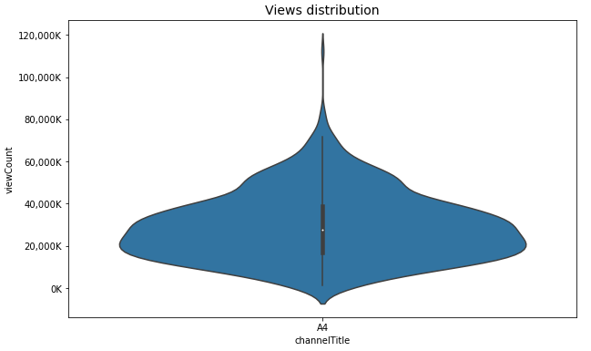

:small_orange_diamond: **Изменчивость количества просмотров во времени**

Данные на графике ниже актуальны только на сегодняшний день. Так как видео постоянно набирают просмотры, информация для видео, выпущенных в прошлом, может меняться. Хотя большинство просмотров собираются приблизительно сразу после выхода видео, тем не менее возможны изменения. 

можно заметить, что начиная с 2019 года, видео стали выходить очень часто. С 2019 по 2021 год был тренд на увеличение количества просмотров. С середины 2021 до начала 2023 года тренд убывает. Также интересно, что самое популярное видео вышло до этого активного периода(вероятно, новые фанаты блогера пересматривают их до сих пор, так и накапливаются просмотры).

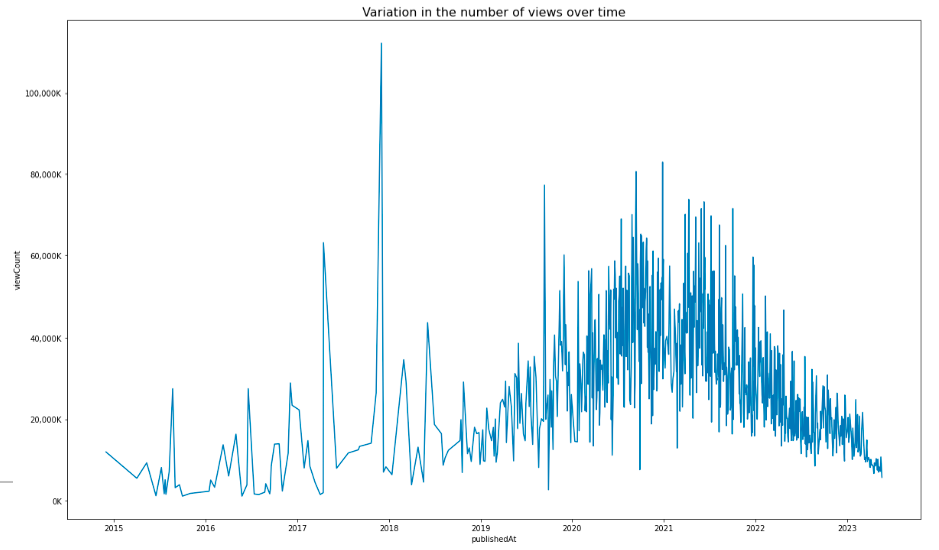

:small_orange_diamond: **Наибольшее число просмотров**

В топ-15 популярных видео можем увидеть что большинство роликов набрали одинаковое количество просмотров (~ 65 миллионов). Самое популярное видео, как уже отмечалось ранее, набрало более 100 млн просмотров. Это музыкальное видео, поэтому можем связать такое количество с тем, что пользователи пересматривали видео несколько раз. Кроме него самыми популярными не музыкальными видео оказались "24 часа в детском саду челлендж", "Побег из картонной тюрьмы челлендж" и "24 часа говорю да младшему брату". (ну а что? ведь его аудитория - дети)

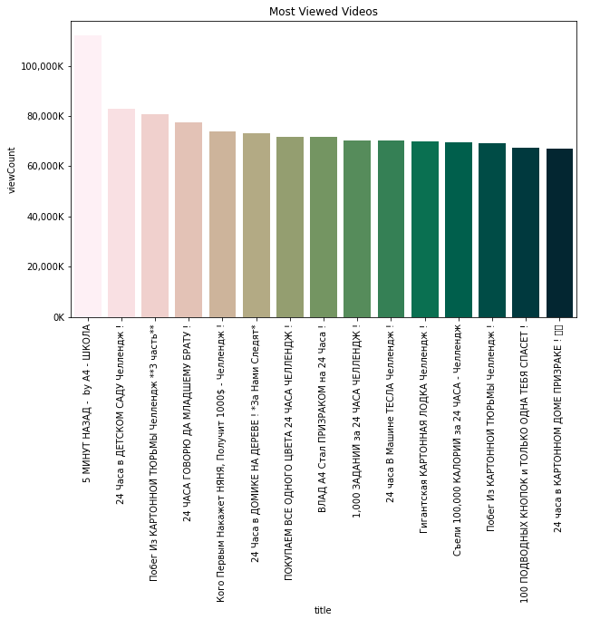

:small_orange_diamond: **Видео с наименьшим числом просмотров**

Минимальное количество просмотров, чуть больше 1 млн просмотров, набрали три видео: "Эмоджи челлендж", "Яичный челлендж" и "Сможешь лучше меня?". Остальные видео собрали от 1,5 млн просмотров.

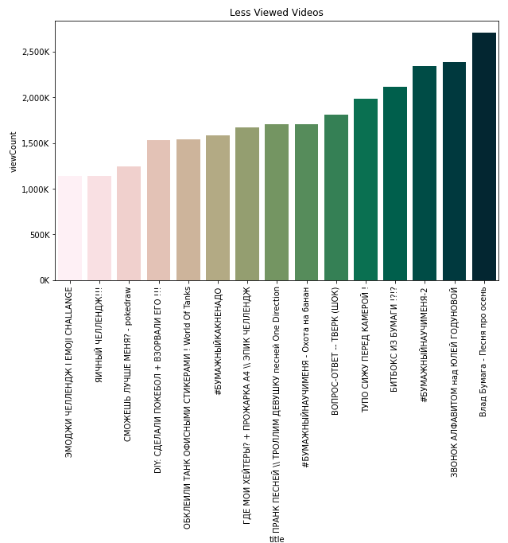

:small_orange_diamond: **Продолжительность видео**

Больше всего выпущено видео продолжительностью 27 минут. В большинстве случаев, видео длятся от 20 до 35 минут. Отмечаются видео длинной в один час.

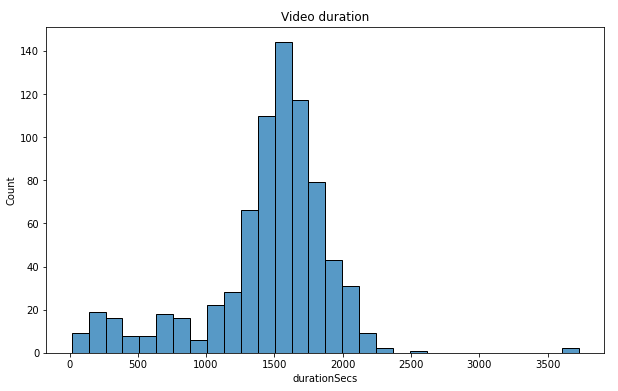

:small_orange_diamond: **Расписание загрузки видео**

Чаще всего видео выпускались по понедельникам, средам, пятницам и субботам.

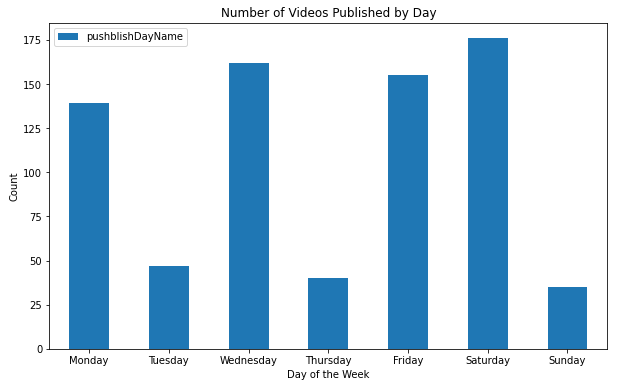

## :pushpin: Проверка предположений

**Важно отметить, что выводы делаются только по данным этого канала и распространяются только на него.**

### :small_blue_diamond: Повышают ли лайки и комментарии просмотры видео?

Количество просмотров не является основным фактором, влияющим на количество комментариев, так как видео с большим количеством просмотров может собрать как много комментариев, так и не очень много. В основном количество комментариев до 250 тыс. 

Есть положительная линейная зависимость между количеством просмотров и лайками. Однако, чем больше просмотров, тем слабее эта связь. Также наблюдаются отскакивающие точки от общего облака значений. 

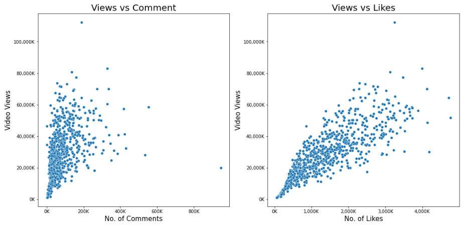

### :small_blue_diamond: Имеет ли влияние продолжительность видео на популярность?

Наибольшее число просмотров набирают видео продолжительностью около 25 минут(1,5 тыс. сек)

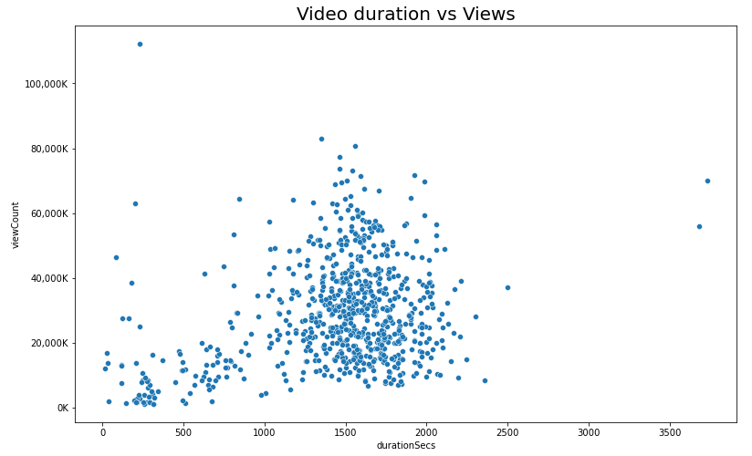

### :small_blue_diamond: Влияет ли продолжительность видео на количество лайков и комментариев?

Зависимость комментариев от продолжительности видео есть. Хоть и облако точек достаточно плотное, однако виден пик, когда отмечается наибольшее значение комментариев и лайков. Больше всего комментариев оставляют под видео длительностью около 25 минут. То же самое и с количеством лайков

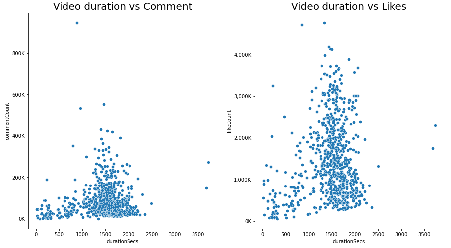

### :small_blue_diamond: Имеет ли значение день загрузки?

По дням недели прослеживается такая динамика: в частые дни загрузок видео(пн, ср, пт, сб) больше просмотров. Если сравнивать с графиком по дням загрузки видео, можно отметить, что во вт, чт и вс выпускалось намного меньше видео(почти в 4 раза), чем в другие дни, но разница в просмотрах не настолько велика.

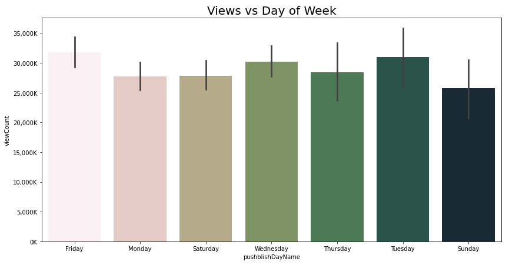

Отмечается зависимость от месяца публикации. в начале года(январь, февраль) меньше всего просмотров. Вероятно, это связано с тем, что просто выпускается меньше видео. Наибольшее число просмотров набирают видео выпущенные в октябре и декабре.

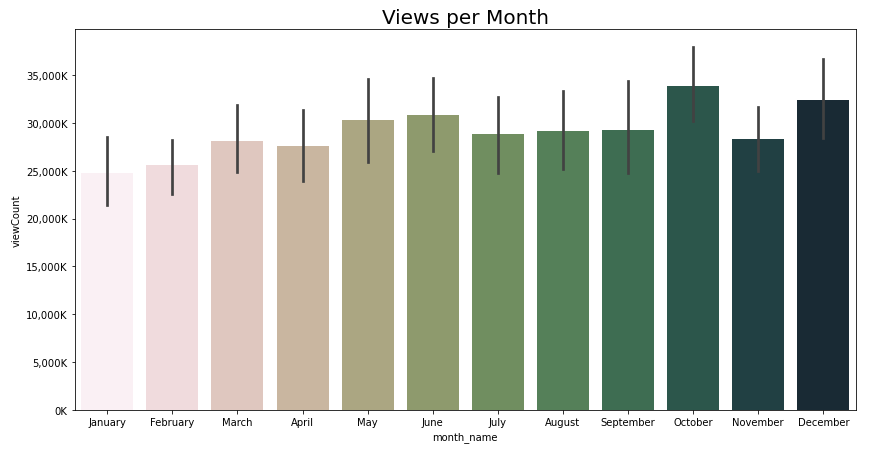

## :pushpin: Выводы

:white_check_mark: 1. Создано клиентское подключение к YouTube API, что позволило получить доступ к различным операциям и методам YouTube API, таким как поиск видео, получение информации о каналах и загрузка видео. 

:white_check_mark: 2.  С помощью клиентского подключения были получены данные о канале, основной плейлист с ID всех видео канала, характеристики каждого видео. Эти данные послужили основой для дальнейшего анализа.

:white_check_mark: 3. В ходе EDA были сделаны следующие наблюдения:

   - Канал насчитывает 756 видео, 45,4 миллиона подписчиков и 22 миллиарда просмотров на 22 мая 2023 года.
   - Были обнаружены две аномалии, которые были удалены из датафрейма, так как не несут полезной информации и могут искажать результаты.
   - Среднее количество просмотров видео составляет около 27 миллионов.
   - Средняя продолжительность видео составляет примерно 24 минуты.
   - Количество лайков на видео в среднем составляет 1,4 миллиона, что значительно меньше количества просмотров.
   - Под видео Влада А4 в среднем оставляют около 85 тысяч комментариев.
   - Были проведены анализы распределения просмотров, видео с наибольшим и наименьшим числом просмотров, продолжительности видео и расписания загрузки видео.

:white_check_mark: 4. Были проверены несколько предположений:

   - Количество просмотров не является основным фактором, влияющим на количество комментариев, но есть положительная линейная зависимость между количеством просмотров и лайками.
   - Видео продолжительностью около 25 минут имеют наибольшее количество просмотров.
   - Продолжительность видео влияет на количество комментариев и лайков, и видео длительностью около 25 минут имеют наибольшее количество комментариев и лайков.
   - День загрузки видео может влиять на количество просмотров, с наибольшим числом просмотров в понедельник, среду, пятницу и субботу.
   - Важно отметить, что данные предположения относятся только к исследуемому каналу и не могут быть обобщены на другие YouTube каналы.

Полученные выводы могут быть полезны для анализа и понимания популярности и характеристик видео на YouTube канале.

